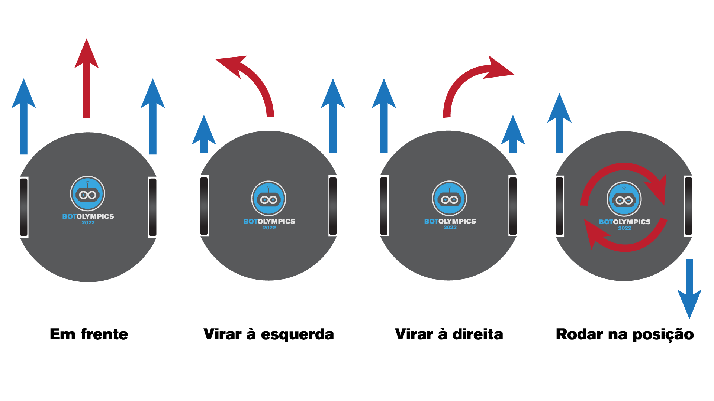

# Prova FCTUC
# ATUALIZAR ESTE README E O ANO DA IMAGEM
# FAZER SKETCHES EXEMPLO

## Hardware Robô

### Pin Mapping

| Pino Arduino |        Hardware       |            Notas           |
|:------------:|:---------------------:|:--------------------------:|
|       0      |           RX          |     Comunicação Serial     |
|       1      |           TX          |     Comunicação Serial     |
|       2      |    Encoder Esquerda   |       Usa interrupts       |
|       3      |    Encoder Direita    |       Usa interrupts       |
|       4      |     Motor 1 - Dir     |         ----------         |
|       5      |     Motor 1 - PWM     |         ----------         |
|       6      |     Motor 2 - PWM     |         ----------         |
|       7      |      LED NeoPixel     |         ----------         |
|       8      |     Motor 2 - Dir     |         ----------         |
|       9      |         Buzzer        |         ----------         |
|      10      |  XSHUT LiDAR Direita  |         ----------         |
|      11      |   XSHUT LiDAR Frente  |         ----------         |	--RFID MOSI
|      12      |  XSHUT LiDAR Esquerda |         ----------         |	--RFID MISO
|      13      |      LED Arduino      |       LED Incorporado      |	--RDID SCK
|      A0      |       ----------      |         ----------         |
|      A1      |         Botão         |         ----------         |
|      A2      |       ----------      |         ----------         |
|      A3      |       ----------      |         ----------         |
|      A4      |      SDA Sensores     |     Sensor Cor / LiDAR     |
|      A5      |      SCL Sensores     |     Sensor Cor / LiDAR     |

### Motores

O Robô está equipado com 2 motores, controlados atráves de uma *H-Bridge* DRV8833.

#### Truth Table DRV8833

| INx-1 | INx-2 | Mx-1 | Mx-2 |        Função        |
|:-----:|:-----:|:----:|:----:|:--------------------:|
|   0   |   0   |   Z  |   Z  |    Abrandar Lento    |
|   0   |   1   |   L  |   H  |    Sentido Horário   |
|   1   |   0   |   H  |   L  | Sentido Anti-Horário |
|   1   |   1   |   L  |   L  |        Travar        |

L -> Ligado a GND  
H -> Ligado a VCC  
Z -> Alta Impedância  

Tendo em conta a tabela anterior é possível controlar a velocidade dos motores da seguinte forma:

| Dir |   PWM   |        Função        |
|:---:|:-------:|:--------------------:|
|  0  |    0    |    Abrandar Lento    |
|  0  |   PWM   |    Sentido Horário   |
|  1  | 1 - PWM | Sentido Anti-Horário |
|  1  |    1    |        Travar        |

Considerando o 0 < PWM < 1, adptando para o valor usado pelo arduino (0 < PWM < 255) -> 255 - PWM.

Tratando-se de um robô com condução diferencial, é possível fazer o robô mudar de direção ao aumentar (ou diminuir) a velocidade de uma roda em relação à outra. Ao rodar as rodas com velocidades iguais mas sentidos opostos é possível fazer o robô rodar sobre si próprio.  
Na imagem é possível ver os exemplos mencionados.  

## Sensores

### Sensor de Chama

Para detetar a vela o robô dispõe de um sensor de infravermelhos. 
O sensor é capaz de detetar uma chama diretamente à sua frente, devolendo um sinal analógico que pode ser obtido através de um ADC do arduino.  
Para testar o sensor e obter os valores *threshold* existe um código de exemplo [aqui](exemplos/TesteChamaBuzzer.cpp "Exemplo Sensor de Chama").  

### Sensor de Cor

Para detetar a entrada num quarto, que se encontra delemitado por uma linha branca existe um sensor de cor na parte inferior do robô.  
O modelo deste sensor é TCS34725, este devolve os valores para a cor Vermelha, Verde, Azul e o Clear. Código de exemplo disponível [aqui](exemplos/TesteCorPixel.cpp "Exemplo Sensor de Cor").

### Sensor de Distância

O robô está equipado com 3 LiDARs que permitem medir a distância a objetos 
